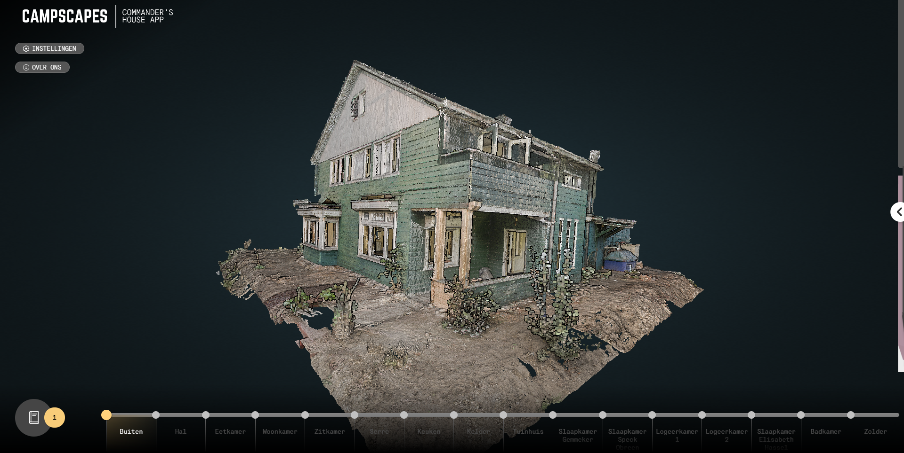

# Westerbork Commander's House App

A virtual tour through the commander's house at Camp Westerbork. Build using [Vue](https://vuejs.org/) for the UI and [Potree](http://potree.org/) for the visualization of the point clouds.



## Prerequisites

- npm

## Install
```
npm install
```

### Develop

Run:

```
npm run serve
```

Browse to http://localhost:8080

### Deploy

Run:

```
npm run build
```

Serve the created `dist` folder using a webserver.
